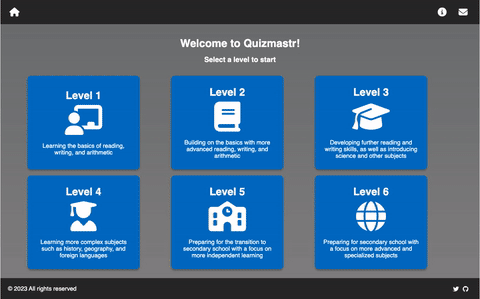

## About Quizmastr

Quizmastr is designed to help students test their knowledge and learn new things in a fun and interactive way. With a variety of questions on different subjects, the quizzes are perfect for students who want to challenge themselves and expand their horizons.



You can bring your own backend and point an instance of the application to it, with some minor updates to the [Quiz Page](https://github.com/swiftugandan/quizmastr/blob/32b4a2a2fbc9f7cdfaafcbd7b144b76c8fd20c68/pages/year/%5Byear%5D/subject/%5Bsubject%5D/index.js#L96).

## Getting Started

For developers, this is a [Next.js](https://nextjs.org/) project bootstrapped with [`create-next-app`](https://github.com/vercel/next.js/tree/canary/packages/create-next-app).

To, run the development server locally:

```bash
npm run dev
# or
yarn dev
# or
pnpm dev
```

Open [http://localhost:3000](http://localhost:3000) with your browser to see the result.

You can also use Gitpod in the cloud [](https://gitpod.io/#https://github.com/swiftugandan/quizmastr/)


## Deploy on Vercel
[](https://vercel.com/new/clone?repository-url=https%3A%2F%2Fgithub.com%2Fswiftugandan%2Fquizmastr)

The easiest way to deploy your Next.js app is to use the [Vercel Platform](https://vercel.com/new?utm_medium=default-template&filter=next.js) from the creators of Next.js.

Check out the [Next.js deployment documentation](https://nextjs.org/docs/deployment) for more details.

## License

Licensed under the [MIT license](https://github.com/swiftugandan/quizmastr/blob/main/README.md)


## 🧰 Contributing

- Contributions make the open source community an amazing place to learn, inspire, and create.
- Any contributions you make are **truly appreciated**.

## 🙏 Support

Don't forget to leave a star ⭐️
